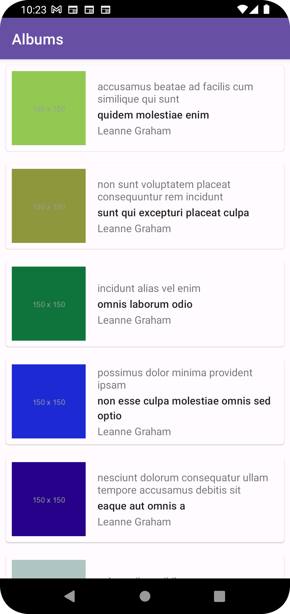
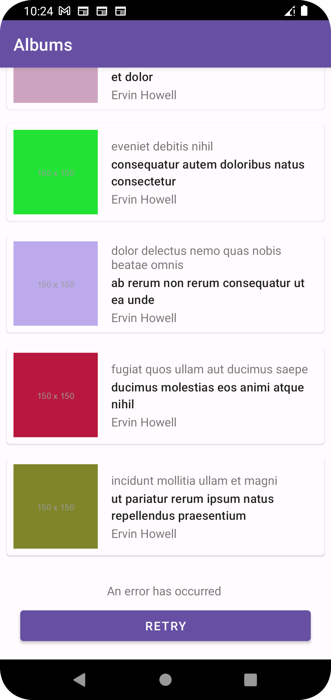
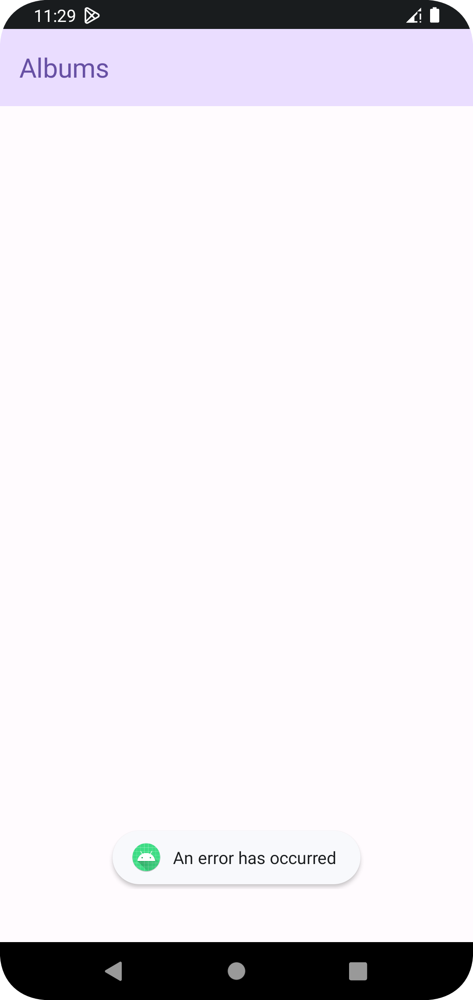
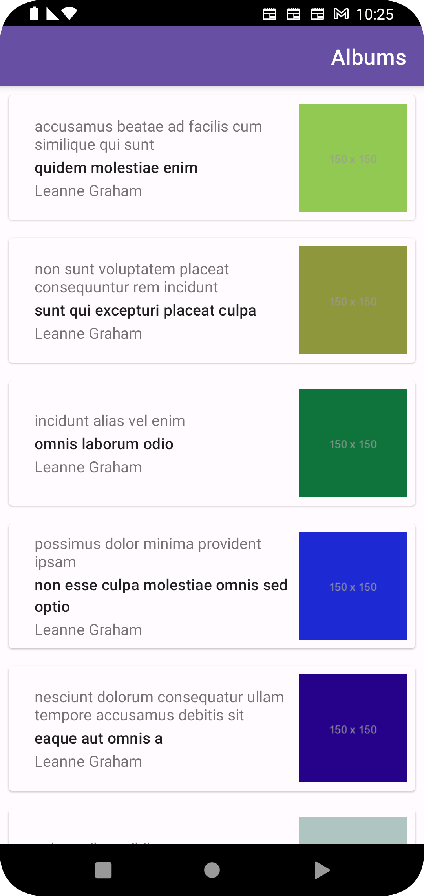

## Setup

The project requires JDK 17, which can be set
via `Settings > Build, Execution, Deployment > Build Tools > Gradle > Gradle JDK`.

## Feature

- This app shows list of `photo albums` - with album title, username, photo name and photo image.
- The app only shows the first photo of each album.
- The implementation is based on the pagination support via the api endpoints with `start`
  and `limit`
  offsets. I choose pagination solution to ensures network and system resources are used
  efficiently.
  As data set is large and involved calling multiple endpoints.
  The `/users` call is made once and then `/albums` and `/photo` is called as the user scrolls.
- To fetch first photo of each album I rely on `/photos?album{id}&_limit={1}`.

## App

| Albums list success                 | Album page error/retry state            | Failed to get error                | RTL                         |
|-------------------------------------|-----------------------------------------|------------------------------------|-----------------------------|
|  |  |  |  |

## Tests

- AlbumsRepositoryTest
- PhotosRepositoryTest
- UsersRepositoryTest
- GetAlbumAndPhotoUseCaseTest
- GetUserInfoUseCaseTest
- AlbumDetailPagingSourceTest
- AlbumDetailUIModelMapperTest
- AlbumsViewModelTest
