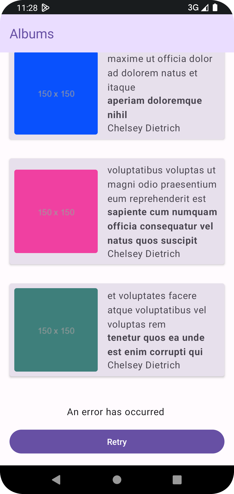

## Setup

The project requires JDK 17, which can be set
via `Settings > Build, Execution, Deployment > Build Tools > Gradle > Gradle JDK`.

## App

This app uses api provided from https://jsonplaceholder.typicode.com/ using `albums`,`photos`
& `users` endpoints.
The api returns dummy text, however the reason to use this api - is to demonstrate optimal
performant solution, when integrating real world rest APIs with client.In addition the api has
no rate limiting.

The API's

- `/albums` return 100 albums
- `/photos` returns 5000 photos
- `/users` returns 10 users
- GET `/photos?albumId=2`  Get resource by ID
- `/albums?_start=1&_limit=10` Supports offset start and limit pagination's

The app shows list of `albums` - aggregating data like `album title`, `username`, `albums photo name and image`
from above endpoints.
Each unique album id has 50 photos, the app show the photo title and image url of first photo of
each album in the list.

| Albums list success          | Album page error/retry state            | Failed to get error                | RTL                               |
|------------------------------|-----------------------------------------|------------------------------------|-----------------------------------|
|  |  |  |  |

## Jetpack Compose support

🗒️ Please see branch [android-view-system](https://github.com/waliahimanshu/typicode-placeholder/tree/android-view-system)
for android xml based view implementation and `main` branch for compose implementaion.

Since I am in process of gaining more hands-on experience of using compose  - I took the opportunity to migrate android view system 
to compose - in more real app setting 

- [Part 1 - Replace recycler view and list items with compose view](https://github.com/waliahimanshu/typicode-placeholder/pull/1)
- [Part 2 - Replace Paging loading and error state UI + image loading coil](https://github.com/waliahimanshu/typicode-placeholder/pull/2)
- [Part 3 - Replace activity and fragment code](https://github.com/waliahimanshu/typicode-placeholder/pull/3)
- [Part 4 - Final cleanup xml themes](https://github.com/waliahimanshu/typicode-placeholder/pull/4)

## Feature

| Demo  | 
|------------------------------|
| |

- This app shows list of `albums` - with album `title`, `username`, `photo name and url`.
- The app only shows the first photo of each album.
- The implementation is based on the pagination support via the api endpoints with `start`
  and `limit` offsets. I decided to use pagination solution to ensures network and system resources are used
  efficiently.
- As data set is large and involved calling multiple endpoints. The `/users` call is made once and
   and `/photo` is called concurrently as the user scrolls.
- To fetch first photo of each album I rely on limit offset - this ensures less data is transferred
  when fetching photos of each album `/photos?album{id}&_limit={1}`, since we are only interested in 
the fist item.

## Tests

- AlbumsRepositoryTest
- PhotosRepositoryTest
- UsersRepositoryTest
- GetAlbumAndPhotoUseCaseTest
- GetUserInfoUseCaseTest
- AlbumDetailPagingSourceTest
- AlbumDetailUIModelMapperTest
- AlbumsViewModelTest

